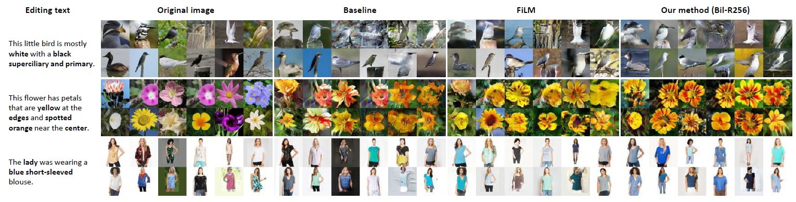

# BilinearGAN_for_LBIE
Implementation of our paper "Bilinear Representation for Language-Based Image Editing using Conditional Generative Adversarial Networks"



## Requirements
- Python 2
- PyTorch 0.3.1
- Torchvision
- FastText
- NLTK

## FastText Install
```
 $ git clone https://github.com/facebookresearch/fastText.git
 $ cd fastText
 $ pip install .
```
Download a pretrained [English](https://s3-us-west-1.amazonaws.com/fasttext-vectors/wiki.en.zip) word vectors. Unzip it and move `wiki.en.bin` to `fasttext_models/`

## Datasets download
- Oxford-102 flowers: [images](http://www.robots.ox.ac.uk/~vgg/data/flowers/102/102flowers.tgz) and [captions](https://drive.google.com/file/d/0B0ywwgffWnLLMl9uOU91MV80cVU/view?usp=sharing)
- Caltech-200 birds: [images](http://www.vision.caltech.edu/visipedia-data/CUB-200-2011/CUB_200_2011.tgz) and [captions](https://drive.google.com/file/d/0B0ywwgffWnLLLUc2WHYzM0Q2eWc/view?usp=sharing)
- Fashion Synthesis: download `language_original.mat`, `ind.mat` and `G2.zip` from [here](https://drive.google.com/drive/folders/0B7EVK8r0v71pTHhMenkxbE9fTVk)

Move all the downloaded files into `datasets/` and extract them. 

## Train

### Oxford-102 flowers
**Stage1:** train visual-semantic embedding model.
```
python2 train_text_embedding.py \
    --img_root ./datasets \
    --caption_root ./datasets/flowers_icml \
    --trainclasses_file trainvalclasses.txt \
    --fasttext_model ./fasttext_models/wiki.en.bin \
    --save_filename ./models/text_embedding_flowers.pth
```

**Stage2:** train BilinearGAN for Language-Based Image Editing (LBIE).
```commandline
python2 train.py \
    --img_root ./datasets \
    --caption_root ./datasets/flowers_icml \
    --trainclasses_file trainvalclasses.txt \
    --fasttext_model ./fasttext_models/wiki.en.bin \
    --text_embedding_model ./models/text_embedding_flowers.pth \
    --save_filename ./models/flowers_res_lowrank_64.pth \
    --use_vgg \
    --fusing_method lowrank_BP
```

### Caltech-200 birds
**Stage1:** train visual-semantic embedding model.
```commandline
python2 train_text_embedding.py \
    --img_root ./datasets/CUB_200_2011/images \
    --caption_root ./datasets/cub_icml \
    --trainclasses_file trainvalclasses.txt \
    --fasttext_model ./fasttext_models/wiki.en.bin \
    --save_filename ./models/text_embedding_birds.pth
```
**Stage2:** train BilinearGAN for Language-Based Image Editing (LBIE).
```commandline
python2 train.py \
    --img_root ./datasets/CUB_200_2011/images \
    --caption_root ./datasets/cub_icml \
    --trainclasses_file trainvalclasses.txt \
    --fasttext_model ./fasttext_models/wiki.en.bin \
    --text_embedding_model ./models/text_embedding_birds.pth \
    --save_filename ./models/birds_res_lowrank_64.pth \
    --use_vgg \
    --fusing_method lowrank_BP
```

### Fashion Synthesis
**Stage1:** preprocess training data by runing `python2 process_fashion_data.py`.

**Stage2:** train visual-semantic embedding model.
```commandline
python2 train_text_embedding.py \
    --img_root ./datasets \
    --caption_root ./datasets/FashionGAN_txt \
    --trainclasses_file trainclasses.txt \
    --fasttext_model ./fasttext_models/wiki.en.bin \
    --save_filename ./models/text_embedding_fashion.pth
```

**Stage3:** train BilinearGAN for Language-Based Image Editing (LBIE).
```commandline
python2 train.py \
    --img_root ./datasets \
    --caption_root ./datasets/FashionGAN_txt \
    --trainclasses_file trainclasses.txt \
    --fasttext_model ./fasttext_models/wiki.en.bin \
    --text_embedding_model ./models/text_embedding_fashion.pth \
    --save_filename ./models/fashion_res_lowrank_64.pth \
    --use_vgg \
    --fusing_method lowrank_BP
```

### Other fusing methods

You can modify `--fusing_method` to train the model by different fusing methods: `lowrank_BP`, `FiLM` and default is `concat`


## Test
- Oxford-102 flowers
```commandline
python2 test.py \
    --img_root ./test/flowers \
    --text_file ./test/text_flowers.txt \
    --fasttext_model ./fasttext_models/wiki.en.bin \
    --text_embedding_model ./models/text_embedding_flowers.pth \
    --generator_model ./models/flowers_res_lowrank_64.pth \
    --output_root ./test/result_flowers \
    --use_vgg \
    --fusing_method lowrank_BP
```
- Caltech-200 birds
```commandline
python2 test.py \
    --img_root ./test/birds \
    --text_file ./test/text_birds.txt \
    --fasttext_model ./fasttext_models/wiki.en.bin \
    --text_embedding_model ./models/text_embedding_birds.pth \
    --generator_model ./models/birds_res_lowrank_64.pth \
    --output_root ./test/result_birds \
    --use_vgg \
    --fusing_method lowrank_BP
```
- Fashion Synthesis
```commandline
python2 test.py \
    --img_root ./test/fashion \
    --text_file ./test/text_fashion.txt \
    --fasttext_model ./fasttext_models/wiki.en.bin \
    --text_embedding_model ./models/text_embedding_fashion.pth \
    --generator_model ./models/fashion_res_lowrank_64.pth \
    --output_root ./test/result_fashion \
    --use_vgg \
    --fusing_method lowrank_BP
```

## Reference
- [Semantic Image Synthesis via Adversarial Learning](https://arxiv.org/abs/1707.06873)

- [StackGAN: Text to Photo-realistic Image Synthesis
with Stacked Generative Adversarial Networks](http://openaccess.thecvf.com/content_ICCV_2017/papers/Zhang_StackGAN_Text_to_ICCV_2017_paper.pdf)

- [Generative Adversarial Text-to-Image Synthesis](http://arxiv.org/abs/1605.05396)
